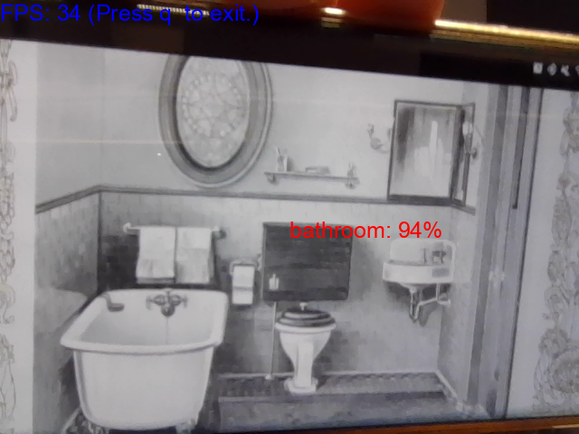

# room-classification

## Data

I got data from [here](https://drive.google.com/file/d/0BxDIywue_VABY1dRcFVvZ3BodnM/view?usp=sharing). You should apply for permission first. Download it and name it as `data`.

## Model

You can download a pretrained model from [here](https://github.com/tae898/room-classification/releases/download/v0.1/model.ckpt). It's a fine-tuned [EfficientNet-b3](https://github.com/lukemelas/EfficientNet-PyTorch) using [pytorch-lightning](https://www.pytorchlightning.ai/)

## Prerequisites

1. A unix or unix-like x86 machine
1. python 3.8 or higher.
1. Running in a virtual environment (e.g., conda, virtualenv, etc.) is highly recommended so that you don't mess up with the system python.
1. `pip install -r requirements.txt`

## Understand data, training, and evaluation

1. Check out [`explore-data.ipynb`](explore-data.ipynb) to explore dataset.
1. Run [`train.py`](train.py) to train.
1. Check out [`evaluation.py`](evaluation.ipynb) to evaluate and see some samples.

## Deploying

### Server

This Flask server is implemented in [`app.py`](app.py). It receives an image and outputs a
probability distribution over the seven room types (i.e., interior, bathroom, bedroom, exterior, living_room, kitchen, and dining_room).

There are two ways to run the server. You can either run in natively in Python or as a docker container. The docker way is recommended.

- The [docker](https://docs.docker.com/get-docker/) way (recommended)

  1. Install docker.
  1. For GPU,
     ```
     docker run -it --rm -p 10005:10005 --gpus all tae898/room-classification-cuda
     ```
  1. For CPU
     ```
     docker run -it --rm -p 10005:10005 tae898/room-classification-cuda
     ```

- Running natively in Python (GPUs are supported)

  1. First do [Prerequisites](#prerequisites)
  1. Download [`model.ckpt`](https://github.com/tae898/room-classification/releases/download/v0.2/model.ckpt) and place it in the root repo directory.
  1. ```sh
     python app.py
     ```

### Client

The Python client either sends an image to the server. This image is either saved in your disk or your webcam stream.

1. First do [Prerequisites](#prerequisites)
1. Install requirements
   ```sh
   pip install -r requirements-client.txt
   ```
1. Run the [server](#server)

- Run the room-classifier on the image saved in your disk:

  ```sh
  python client.py --mode image --image-path path/to/the/image.jpg
  ```

  This will save the results at `path/to/the/image.jpg.json`

- Run the room-classifier on webcam:

  ```sh
  python client.py --mode webcam
  ```

  

## TODOs

1. Make it lighter

## Contributing

Contributions are what make the open source community such an amazing place to be learn, inspire, and create. Any contributions you make are **greatly appreciated**.

1. Fork the Project
1. Create your Feature Branch (`git checkout -b feature/AmazingFeature`)
1. Run `make style && quality` in the root repo directory, to ensure code quality.
1. Commit your Changes (`git commit -m 'Add some AmazingFeature'`)
1. Push to the Branch (`git push origin feature/AmazingFeature`)
1. Open a Pull Request

## Citation

[](https://zenodo.org/badge/latestdoi/464516842)

## Authors

- [Taewoon Kim](https://taewoon.kim/)
